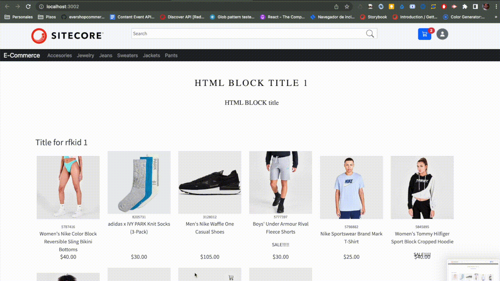

<p align="center">
  <a href="https://www.sitecore.com/">
    
  </a>
</p>
<h3 align="center">Sitecore Discover Starter Kit</h3>

<p align="center">
 A website built using React + Sitecore Discover SDK for React
  <br>
  <a href="https://developers.sitecorecloud.io/discover-sdk/react/website" target="_blank"><strong>Demo »</strong></a>
  <br>
  <br>

# Sitecore Discover Starter Kit

This repository has an example implementation of an e-commerce platform using the `Sitecore Discover SDK` which
provides integration with Sitecore Discover services, giving the ability to support experience tracking events +
search/recommendation service to empower the commerce experience.

## Table of contents

- [Build Prerequisites](#build-prerequisites)
- [Quick start](#quick-start)
- [Pages](#Pages)
    - [Home](#Home)
    - [Search](#Search)
    - [Category Pages](#Category-Pages)
    - [Product Detail Page](#Product-Detail-Page)
    - [Cart Page](#Cart-Page)
    - [Order Confirm Page](#Order-Confirm-Page)
- [Events](#Events)
    - [Automatically fired events](#Automatically-fired-events)
    - [Manually tracked events](#Manually-tracked-events)
    - [Monitoring Example](#Monitoring-example)
- [Learn More](#learn-more)

## Build Prerequisites
### Node.js

The Sitecore Discover Starter Kit needs to have Node.js installed to build the project. You can find the latest version of Node.js [here](https://nodejs.org/en/). We recommend using the LTS version of Node.js.

### Environment Variables

The Sitecore Discover Starter Kit needs some environment variables to work. Those can be gathered from the Customer Engagement Console (CEC). For full functionality, you must create a **.env.local** file in the root of the project and add in the below environment variables.

The following variables should exist within the .env.local file:

```
REACT_APP_ENV="<environment - Expected values: prod, staging or prodEu >"
REACT_APP_CUSTOMER_KEY="<customer key>"
REACT_APP_API_KEY="<API key provided in CEC>"
```


## Quick start

To start using `Sitecore Discover Starter Kit` please follow the instructions:
1. Install [Node.js](htts://nodejs.org/en/), we recommend the LTS version.
2. Clone the repository: `git clone https://github.com/Sitecore/Discover-JS-SDK-Starter-kit.git`
3. Inside the repository run `npm install` to install all the dependencies.
4. Create a `.env.local` file in the root of the project and add the following environment variables:
```
REACT_APP_ENV="<environment - Expected values: prod, staging or prodEu >"
REACT_APP_CUSTOMER_KEY="<customer key>"
REACT_APP_API_KEY="<API key provided in CEC>"
```
(For more information on populating environment variables see section **Environment Variables** above.)

5.  Run `npm start` to start the development server.
6.  Open the **http://localhost:3000** in your browser to see the result!

In case you want to build the app for production run: `npm run build`

## Widget Configurations
In order to renders all the widgets included in a hosted page configured from CEC app using `PageWidgets` component provided from Sitecore SDK or `usePageWidgets` hook to build a custom page widget component, we have created a configuration file called `sitecoreWidgetsConfig.js` to register the components used for each widget type. This file is imported in `App.js` to be access in all the pages.

## Pages

The following is a list of pages that the website has to cover all event tracking available within the SDK.
To perform page navigation it uses React Router.
Each page is a React component and it has an `useEffect` hook in order to register the page uri change.

For example, for home page we will have:

```javascript
useEffect(() => {
    PageController.getContext().setPageUri('/');
}.[]);
```

That allows the SDK to change the context of the browser, customizing the tracking/service responses according to that
specific context.

On this demo site, a higher order component called `withPageTracking` has been created to be used in each page and register the page uri change and track event view.

### Home

Route: `/`
Shows the main page of the site.
This page has an example of how to render the widgets configured for this page on CEC panel using `usePageWidgets` hook and some other static recommendation widgets.

It tracks:

- A `page view` event.
- A `widget appear` event per widget that appears on the page.

### Search

Route: `/search`
Shows the search results after submitting the form on the site header.

It tracks:

- A `page view` event.
- A `widget appear` event for the SearchResult widget present on the page.

### Category Pages

Route: `/category/<category sanitized name>`. E.g.: `/category/fan-gear-jerseys`
Shows a search results page layout but only shows results that belong to that category.

It tracks:

- A `page view` event.
- A `widget appear` event for the SearchResult widget present on the page (this page also uses a SearchResults type
  widget to show the products).

### Product Detail Page

Route: `/product/detail/<product sku>/<product id>`. E.g.: `/product/detail/3107756/prod1100011`
Shows a product details page. It also shows a recommendation widget with related products to the main one.

__Note:__
*In this case, the product information is wrapped on a `SearchResults` widget that uses a filter by sku since there
isn't a datasource.
It is not recommended to perform this in this way (usually the way that a Product Detail Page looks is handled by the
SDK consumer and the data is gathered by their own datasets).
Sitecore Discover Services are used to search and recommend.*

It tracks:

- A `page view` event.
- A `PDP view` event with the SKU from the product shown (triggered manually, more information on events section).
- A `widget appear` event for the SearchResult widget present on the page (please read note above).
- A `widget appear` event for the Recommendation widget present on the page.

### Cart Page

Route: `/cart`
Shows a list of the products that were added to the cart. Also, it includes a `Recommendation` widget showing the
recently purchased together products.

It tracks:

- A `page view` event.
- A `widget appear` event for the Recommendation widget present on the page.
- Depending on the user interaction, it might report `add to cart` events (if an element was added to the cart)
  or `cart status` events (if an element was removed from cart).

### Order Confirm Page

Route: `/order/confirmation`
Shows the confirmation of the purchase. It also includes a `Recommendation` widget showing the recently purchased
together products.

It tracks:

- A `page view` event.
- A `widget appear` event for the Recommendation widget present on the page.
- An `order confirm` event (the user sent on the event is a mock user).

## Events

Events are an important part of the Sitecore Discover platform. It has an impact about the results that are going to be
displayed.
The following is a list of the events that are fired by the SDK classified by the ones that fire automatically within
the widgets (the ones that the SDK can infer) and the
ones that need to be triggered verbosely (the ones that the SDK can't infer).
The sample site has both and can be seen along the source code.

### Automatically fired events

- Page View
- Widget Appear
- Facet click (on `SearchResults`)
- Arrow click (on `Recommendation`)
- Product click

### Manually tracked events

- Add to cart
- Add to wishlist
- Cart Status
- Order Confirm
- PDP view

### Monitoring example

Event tracking can be also debugged using the Customer Engagement Console (CEC).
The following video shows how to verify what are the events that the SDK is triggering:



## Learn More

To learn more about Sitecore Discover SDKs, take a look at the following resources:
- [Sitecore Discover SDKs for integration](https://doc.sitecore.com/discover/en/developers/discover-developer-guide/using-sitecore-discover-sdks-for-integration.html)
- [Discover UI Components reference documentation](https://developers.sitecorecloud.io/discover-sdk/react/1.x-alpha/storybook/index.html?path=/docs/introduction--page) 